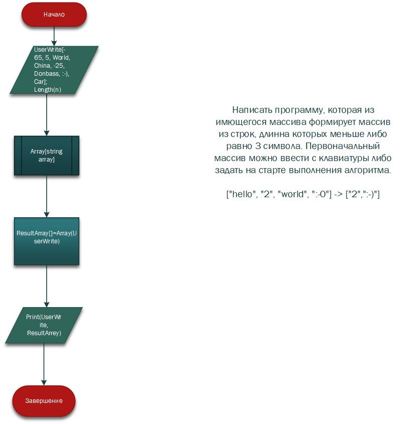

____
# Итоговая проверочная работа
____

    Программный код написана на языке С#. Он решает следующую задачу:
           написать программу, которая из имющегося массива формирует массив из строк, длина которых меньше либо равно 3 символа.

       
